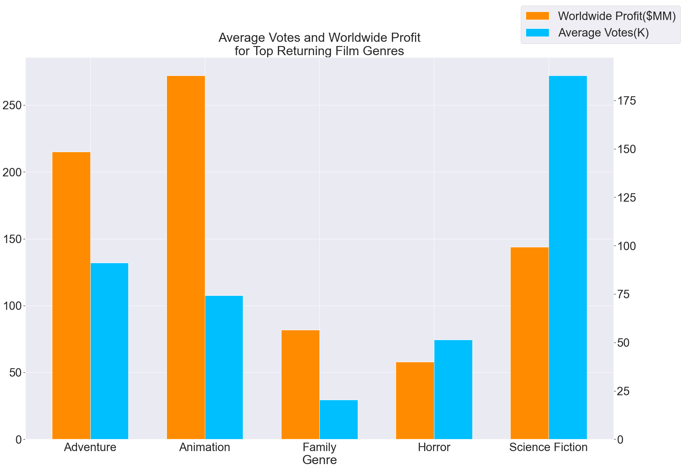
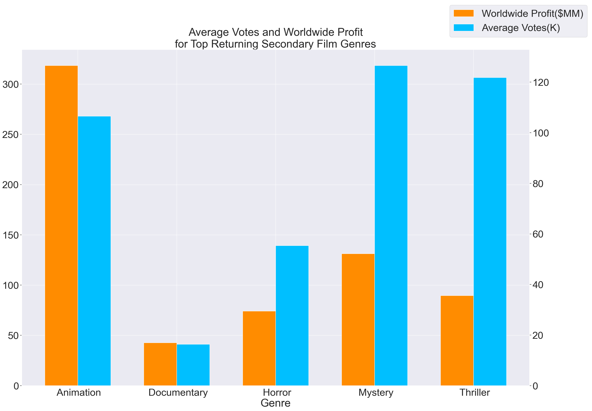
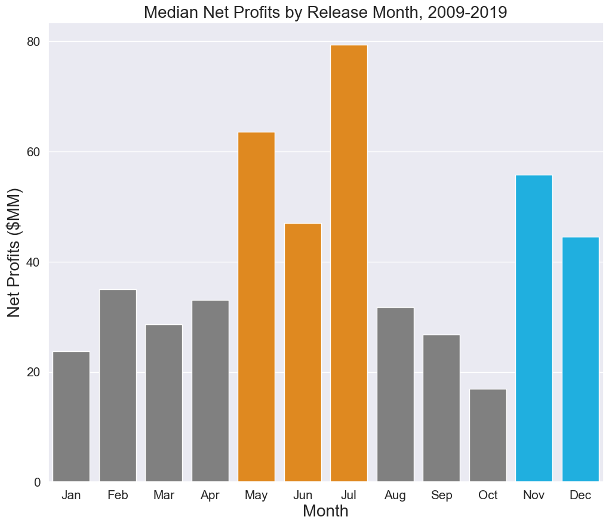
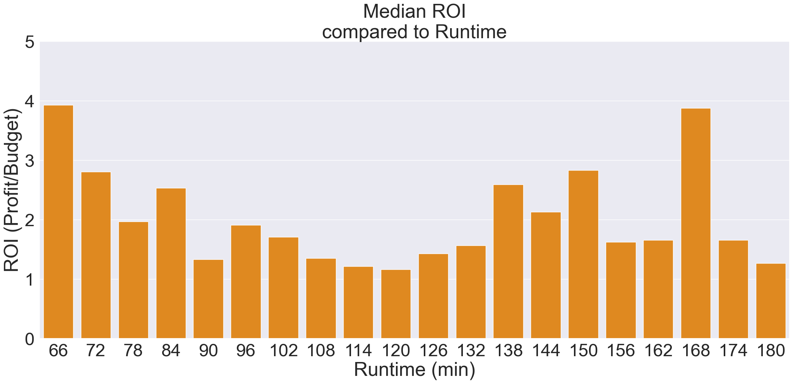

# Recommendations for Microsoft's Brand New Movie Studio

**Authors**: Dietrich Nigh, Annie Zheng, Paul Schulken

## Overview

With the return of theatrical movie releases, in addition to the increase in streaming video content, Microsoft has expressed interest in creating their own movie studio. To maximize their chances of success, they have requested an analysis of the best performing movies at the box office. This analysis explored the factors that tend to make a movie commercially and critically successful. The relationship between box office results and genre, votes received for rating, and release dates were analyzed to determine what combinations were most likely to produce popular and profitable movies.

## Business Problem

Creating a movie studio is a big undertaking and therefore requires a good amount of forethought. Our statistical analysis of variables will assist Microsoft stakeholders in determining the direction of their studio. Like any business, the studio must make money to remain operational so the box office results were focused on from the beginning. Profitability, genre, seasonality, and runtimes were the focal points of the analysis and were deemed to be vital to the success of a movie and the studio itself. What makes a high grossing movie? The team analyzed the gross profits compared to movie genres that most people took interest in as well as seasonality to determine the best release time. We also analyzed run times of movies to determine whether the length of a movie would affect a movie's likability. By determining the factors most correlated with box office success, Microsoft's new studio can use the results to produce movies with confidence that they'll be profitable and well received.

## The Bottom Line

1. Movie creation should focus on Animation.
2. Release in Summer or it could be a bummer. Alternatively, when the weather is lackluster, release a winter blockbuster.
3. Short or long, run times can't go wrong.

## Data

The data used in this analysis was taken from [IMDB](https://www.imdb.com/), [The Numbers](https://www.the-numbers.com/), and [The Movie DB](https://www.themoviedb.org/?language=en-US), websites that track multiple metrics related to movies and allow users to review and discuss these movies. The data files provided release dates, genre information, vote numbers, run time, production budgets, and domestic and worldwide gross figures for thousands of movies. The target variables were the profits which laid a foundation for the rest of the analysis that dove deeper into their respective genres and release dates. The dataset primarily contains quantitative numerical data, with the instance of qualitative categorical data of genres. By representing profit, vote counts, and release years and months as numbers, statistical analysis and conditional filtering could be performed.

## Methods

In order to perform our analysis, our team merged several tables together to obtain a full dataset. In doing so, we accumulated columns that contained duplicate or unnecessary data to our analysis and those columns were dropped. Data such as the numeric genre codes were changed to the respective genre titles that correlated to The Movie Database's database in order to gain a better understanding of movie genre breakdowns. Lastly, columns for Profit and Profit:Budget Ratio were calculated to be used in the visualizations.

The dataset was filtered for movies that had worldwide gross profit greater than the those within the 25th quartile in order to analyze the movies that exceled and profited to a worldwide audience rather than domestically. Our focus were the top grossing movies. The dataset was filtered to only the most recent decade of movies (2009-2019) in order to keep the analysis focused on current movie metrics. The movie genres that made up less than 1% of the data were dropped to prevent outliers from affecting the overall data. Identifying trends in the movies that remain in the data set allowed us to base our recommendations on the most well received movies.

## Limitations

 - Financial data not adjusted for inflation
 - Missing data
 - Data Pollution
 - Cost of acquiring pre-existing intellectual property not factored in

## Data Modeling

Charts were created to provide a visual reference for the master data set. Charting the highest grossing movies compared to their genre, release month, runtime, and number of votes allowed for quick identification of the most frequently occuring variables in successful movies. Statistical measures like the mean and bottom 25% quartile were applied to find average values across the dataset and remove the worst performing movies.

## Evaluation & Results

The analysis showed that animation is very profitable and receives on average received a high number of votes in terms of audience and critic ratings, indicating its popularity.





The answer to the best time to release a movie is clear: the months of May, June, and July are very successful release months. The second best time is either November or December.



The analysis also determined that there was no strong correlation between runtime and return on investment.



## Conclusions

1. Focus on an Animation Genre Movie
    This genre of movie was shown to have the highest profitability, including worldwide gross, net profit, profit to production cost ratio. It has received on average received a high number of votes in terms of audience and critic ratings, indicating its popularity. Due to their typically kid-friendly nature, the potential audience range for animated movies typically spans across the largest age range.

2. Release the Movie in the Summer or Right Before the Winter Holidays
    Movies released around these seasons profited the most. The months of May, June, and July in particular are very successful release months. The second best time is either November or December. Movie awards season typically begins late in the year in the United States and release of a movie before the winter holidays will get your movie in the running just in time. These time periods are generally a time when children are out of school and adults will have time off of work as a result of vacation or holiday leave.

3. Do not be overly concerned with movie Run Time
    There is no strong correlation with profitability or Return on Investment when comparing short vs. long run times. However, audiences do seem to prefer movies either on the shorter side or to strap themselves in for a 2.5 hour epic. If the movie concept captures the audience's attention, they'll be glued to their seats to watch it for the entire duration.

From the start, our focal point was profit. As such, we believe these results would benefit Microsoft should they be taken into consideration. The formula for making money from movies appears to rely on the genre and release date, with the added bonus that the right genre and right release date leads to a well-received movie.

## Future Insights & Next Steps

 - Look into Streaming vs. Box office performance for genres.
 - Explore a potential partnership with Microsoft's Gaming Division to handle animation needs.
 - Determine if any particular actor, director, or writer has an impact on profits or popularity.
 - Compare the data with historical data trends to see if audience preferences have changed over time.

## For More Information

Please review our full analysis in [our Jupyter Notebook](./Phase1_Project_Notebook.ipynb) or our [presentation](./presentation.pdf).

## Repository Structure

```
├── exploratory_files                   <- Jupyter notebooks for data exploration and testing
├── images                              <- Both sourced externally and generated from code
├── zippedData                          <- Data files used in analysis
├── .gitignore                          <- Code to avoid uploading specified files
├── Phase1_Project_Notebook.ipynb       <- Narrative documentation of analysis in Jupyter notebook
├── README.md                           <- The top-level README for reviewers of this project
├── presentation.pdf                    <- PDF version of project presentation
```